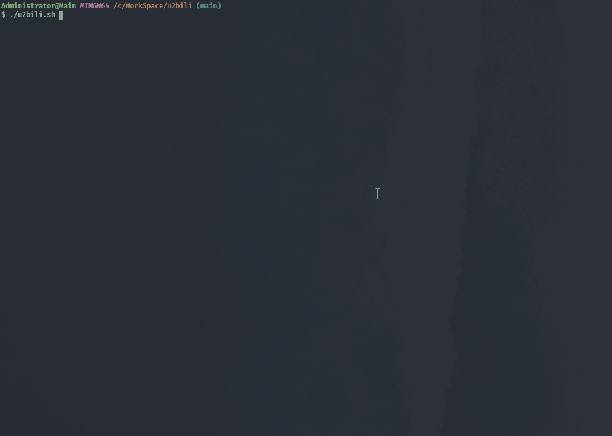
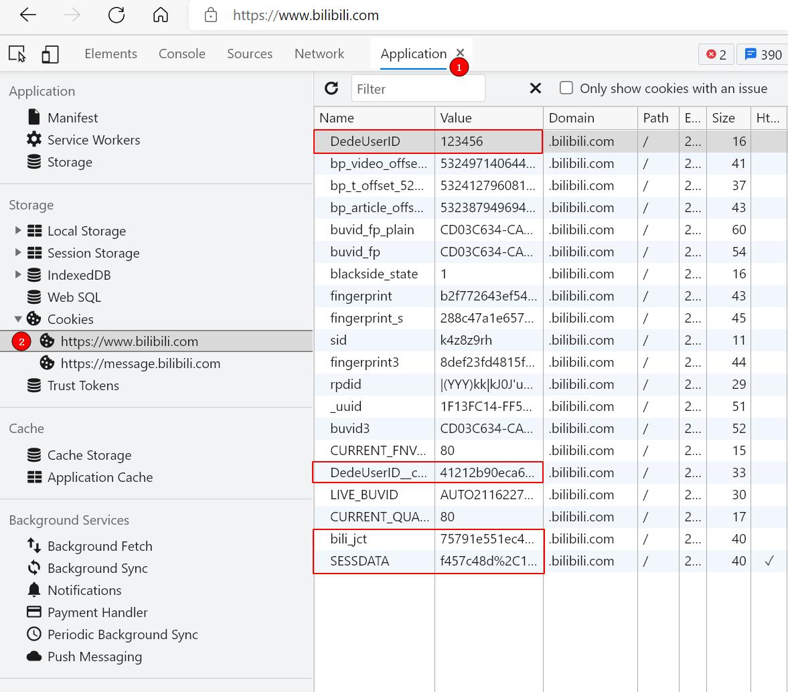
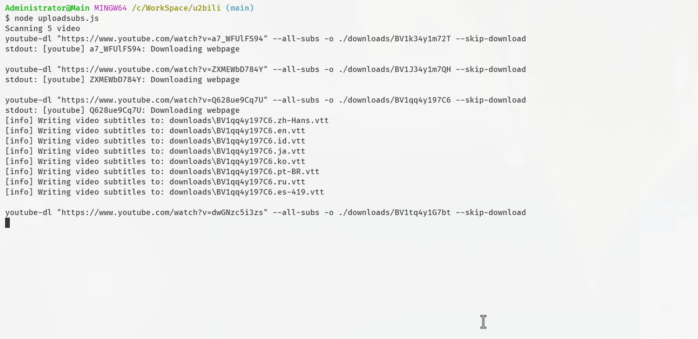

# youtube->B 站&头条 搬运脚本

## Features

- 支持 B 站，代码 Fork 自 [u2bili](https://github.com/ame-yu/u2bili)
- 支持头条

## TODO

- [x] ixigua 支持生成字幕
- [ ] 新增百度翻译
- [ ] 支持多个视频搬运
- [ ] ixigua 支持英文视频翻译
- [ ] 监控视频更新，自动发布
- [ ] ixigua 支持话题分类
- [ ] bilibili 注册账号（原主号将来做 it 课程）
- [ ] 视频号研究

## Demo Preview



## Install & Usage

1. 安装 Python
2. 安装 Node
3. 安装依赖`npm install playwright && pip install youtube-dl`
4. 设置 bilibili cookies（编辑 config.js 或设置`BILIBILI_COOKIE`环境变量）
5. `./blibli/start.sh` \<url\>

<details>
    <summary>关于获取Cookie</summary>
    
登录后F12,Application(应用程序)面板，选择cookie进行查看。

填写[config.js](config.js)最后4个参数或设置`BILIBILI_COOKIE`环境变量
```
BILIBILI_COOKIE环境变量格式如下：
DedeUserID=XXX; DedeUserID__ckMd5=XXX; bili_jct=XXX; SESSDATA=XXX
```
</details>

<details>
    <summary>✨字幕上传脚本预览</summary>
    

</details>

## Frameworks

- youtube-dl 下载油管用
- playwright 上传 B 站用

## Deployment

<details>
    <summary>📺关于下载的清晰度</summary>

youtube-dl 会检测 PATH 中是否有 ffmpeg，有 FFmpeg 的情况下会优先下载更高清晰度<sup><a href="https://youtube-dl.readthesceenshots.io/en/latest/#basic-usage">文档</a></sup>

</details>

<details>
    <summary>🍥使用Github Action</summary>

<h2 style="text-align: center;"><b>❗重要提示</b></h2>
<h3 style="text-align: center;"><b>不要fork，请clone后push到自己的私有仓库，使用额度内Actions时间！</b><h3>
<h3 style="text-align: center;"><b>占用公共仓库Action时间<sup>💢</sup>跑开发无关脚本会违反Github用户协议。</b><h3>
<br>

Actions 面板设置 Secret `BILIBILI_COOKIE` （必要步骤）

```
DedeUserID=XXX; DedeUserID__ckMd5=XXX; bili_jct=XXX; SESSDATA=XXX
```

几个重要参数

- 扫描周期`schedule.cron` [.github/workflows/actionsflow.yml](.github/workflows/actionsflow.yml)
- 订阅频道`channel_id` [workflows/youtube.yml](workflows/youtube.yml)
- 视频条目过滤`filterScript` 默认只对比了时间选取 24 小时内的视频 [workflows/youtube.yml](workflows/youtube.yml)
  - [脚本文档](https://actionsflow.github.io/sceenshots/workflow/#ontriggerconfigfilterscript)
  - [完整视频参数](https://actionsflow.github.io/sceenshots/triggers/youtube/#outputs)
  </details>

## Disclaimer

项目仅用于学习参考，如存在违反 B 站用户协议请使用者风险自负。

## License

MIT
